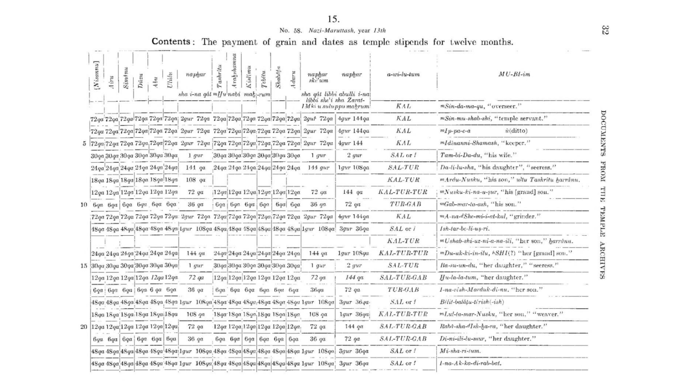

## CS50_SQL

这是CS50的数据库入门课程，将使用一种名为SQL的语言进行教学。你将学习如何通过关系型数据库（这种数据库以行和列的形式存储数据）来创建、读取、更新和删除数据；学习如何使用具有适当类型、触发器和约束的表，对现实世界中的实体及其之间的关系进行建模；学习如何对数据进行规范化，以消除冗余并减少潜在的错误；学习如何使用主键和外键将表连接起来；学习如何通过视图实现搜索自动化，以及通过索引加快搜索速度；学习如何将SQL与Python、Java等其他语言相结合。本课程出于可移植性考虑，从SQLite开始教学，最后还会介绍PostgreSQL和MySQL，以满足可扩展性需求。课程作业的设计灵感来源于现实世界的数据集。

CS50x本身更侧重于计算机科学的基础知识，以及C、Python、SQL和JavaScript等语言的编程教学，而本课程（又称CS50 SQL）则完全聚焦于SQL。你可以在修读CS50x之前、期间或之后学习CS50 SQL。但如果想入门计算机科学本身，你仍然应该选修CS50x！

